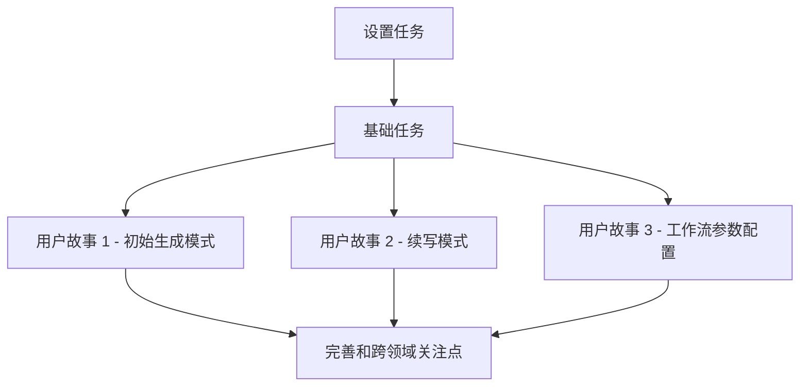

# 任务计划：安卓小说写作助手应用

**Feature Branch**: `1-android-novel-writing-assistant`  
**Created**: 2026-02-03  
**Status**: Draft

## 依赖图

## 实施策略

### MVP 范围
- **核心功能**: 初始生成模式和续写模式
- **优先级**: P1 用户故事优先实现
- **增量交付**: 按用户故事顺序交付，每个故事都是一个可独立测试的增量

### 并行执行策略
- 前端和后端开发可以并行进行
- 不同用户故事的相关任务可以并行执行
- 基础架构和业务逻辑可以并行开发

## 阶段 1：设置任务

### 故事目标
初始化前端和后端项目，配置开发环境和基础架构。

### 任务列表

- [x] T001 创建前端安卓项目结构
- [x] T002 配置前端项目依赖（Kotlin、Jetpack Compose、Material 3、Ktor Client、Room）
- [x] T003 创建后端项目结构
- [x] T004 配置后端项目依赖（Kotlin、Ktor Server、Docker）
- [x] T005 设置版本控制系统和分支策略
- [x] T006 配置 CI/CD 流水线

## 阶段 2：基础任务

### 故事目标
实现所有用户故事的共享基础组件和服务。

### 任务列表

- [x] T007 [P] 实现前端网络请求模块（Ktor Client）
- [x] T008 [P] 实现前端本地存储模块（Room + SharedPreferences）
- [x] T009 [P] 实现后端API基础架构（Ktor Server路由）
- [x] T010 [P] 实现后端Coze API集成模块
- [x] T011 [P] 实现前端UI基础组件（Material 3主题、通用控件）
- [x] T012 [P] 实现前端错误处理和加载状态管理

## 阶段 3：用户故事 1 - 初始生成模式 (P1)

### 故事目标
实现初始生成模式，允许用户上传参考文档、选择题材类型、填写写作内容走向并生成小说内容。

### 独立测试标准
用户可以通过上传文档、选择题材、填写写作方向并启动生成来测试此功能。

### 任务列表

- [x] T013 [US1] 实现初始生成模式界面（参考文档上传、题材选择、写作方向输入）
- [x] T014 [US1] 实现前端文档上传功能（支持md/txt格式，大小限制20MB）
- [x] T015 [US1] 实现后端初始生成API端点
- [x] T016 [US1] 实现后端Coze初始生成流程集成
- [x] T017 [US1] 实现前端生成状态显示和结果展示界面
- [x] T018 [US1] 实现前端生成历史记录功能
- [x] T019 [US1] 测试初始生成模式端到端流程

## 阶段 4：用户故事 2 - 续写模式 (P1)

### 故事目标
实现续写模式，允许用户上传参考文档或直接输入参考内容并生成续写。

### 独立测试标准
用户可以通过选择续写模式、提供参考内容并启动生成来测试此功能。

### 任务列表

- [x] T020 [US2] 实现续写模式界面（参考文档上传、参考内容输入）
- [x] T021 [US2] 实现前端参考内容输入功能
- [x] T022 [US2] 实现后端续写API端点
- [x] T023 [US2] 实现后端Coze续写流程集成
- [x] T024 [US2] 实现前端续写结果展示界面
- [x] T025 [US2] 实现前端续写历史记录功能
- [x] T026 [US2] 测试续写模式端到端流程

## 阶段 5：用户故事 3 - 工作流参数配置 (P2)

### 故事目标
实现工作流参数配置功能，允许用户配置生成和续写的各种参数。

### 独立测试标准
用户可以通过填写不同的参数组合来测试系统对参数的处理能力。

### 任务列表

- [x] T027 [US3] 实现参数配置界面（题材类型选择器、写作方向输入框等）
- [x] T028 [US3] 实现前端参数验证功能
- [x] T029 [US3] 实现后端参数验证和处理逻辑
- [x] T030 [US3] 实现前端参数保存和加载功能
- [x] T031 [US3] 实现后端参数缓存机制
- [x] T032 [US3] 测试参数配置功能

## 阶段 6：完善和跨领域关注点

### 故事目标
完善应用功能，处理跨领域关注点，如性能优化、安全、监控等。

### 任务列表

- [x] T033 实现前端性能优化（缓存策略、延迟加载）
- [x] T034 实现后端性能优化（响应缓存、请求批处理）
- [x] T035 实现应用安全措施（API密钥保护、数据加密）
- [x] T036 实现应用监控和日志记录
- [x] T037 实现应用错误处理和崩溃报告
- [x] T038 实现应用部署和发布流程
- [x] T039 进行最终端到端集成测试
- [x] T040 进行性能测试和安全审计

## 任务统计

- **总任务数**: 40
- **设置任务**: 6
- **基础任务**: 6
- **用户故事 1 任务**: 7
- **用户故事 2 任务**: 7
- **用户故事 3 任务**: 6
- **完善任务**: 8

## 并行执行机会

1. **前端和后端并行**: T007-T012 可以并行执行
2. **用户故事并行**: T013-T019 和 T020-T026 可以并行执行
3. **功能模块并行**: 文档上传、网络请求、UI组件等模块可以并行开发

## 建议的MVP范围

- **核心功能**: 初始生成模式（T013-T019）和续写模式（T020-T026）
- **基础架构**: T001-T012
- **最小可行产品**: 包含两个核心生成模式，能够与Coze API集成并展示生成结果

## 验收标准

- 所有P1用户故事的任务完成
- 每个用户故事都能独立测试通过
- 应用能够正常启动和运行
- 生成和续写功能能够正常工作
- 错误处理和加载状态显示正常